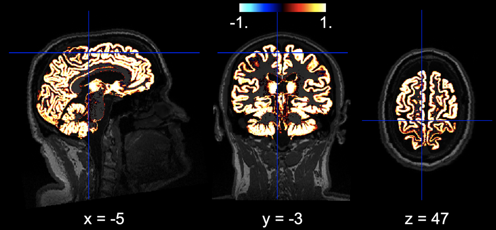

# Brain Volume Analysis and Visualisation

# Outputs

This code offers an end-to-end solution for computing and visualizing the volumes of different brain tissues, specifically grey matter (c1), white matter (c2), and cerebrospinal fluid (CSF, c3). It fetches pre-segmented anatomical images, calculates volumes, and showcases interactive visualisations. Note that I wrote it for Gannet Toolbox segmentation outpu. Gannet is a tool to analyse magnetioc resonance spectroscopy data. you can find more info here: https://markmikkelsen.github.io/Gannet-docs/index.html

## Dependencies

nibabel
numpy
os
nilearn

## **Workflow**

1. Define Image Paths: Sets the paths for the original anatomical T1-weighted image and its corresponding segmented images (grey matter, white matter, and CSF).

2. Compute Volume from Mask: A function to calculate the volume of non-zero voxels from a mask. The volume calculation is based on the voxel dimensions of the image.

3. Volume Calculations: Utilizes the above function to compute volumes of grey matter, white matter, and CSF. Additionally, it calculates the total brain volume excluding and including CSF.

4. Volume Conversion to mL: For ease of understanding, computed volumes (originally in mm^3) are converted to mL.

5. Results Display: Outputs the computed volumes in a structured format.

6. Interactive Visualization: 
    - Displays the anatomical T1-weighted image in an interactive grayscale mode within Jupyter Lab.
    - Visualizes the grey and white matter segmentation overlayed on the anatomical image. These visualizations are saved as HTML files and can be viewed directly in a browser.

## **Usage**

1. Modify Base Directory: Ensure you set `base_dir` to the path where your anatomical and segmented images are stored.

2. Run the Script: Execute the Python script in a Jupyter Lab environment or a similar platform that supports interactive visualization. If not using Jupyter Lab, you might want to comment out or modify the inline visualization sections.

3. View Results: Check the printed results for volume calculations and open the generated HTML files ("sub-013_GreyMatter.html" and "sub-013_WhiteMatter.html") in a browser for visual representation.

## **Notes**

- The code assumes that the segmented images and the anatomical T1-weighted image are named in a specific format. If your filenames differ, ensure you update the paths in the code accordingly.
- The visualisations use a threshold of "90%". You can adjust this value if needed.

